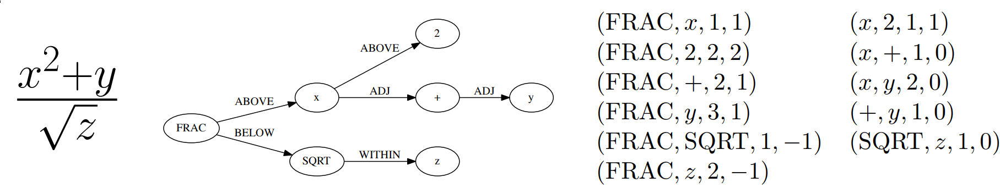

.. This document is written in reStructuredText, a simple and unobstrusive
.. markup language.  For an introductiont to reStructuredText see:
.. 
.. http://www.sphinx-doc.org/en/master/rest.html
.. 
.. Lines like this which start with `.. ` are comments which won't appear
.. in the generated output.
.. 
.. To apply for a GSoC project with Xapian, please fill in the template below.
.. Placeholder text for where you're expected to write something says "FILLME"
.. - search for this in the generated PDF to check you haven't missed anything.
.. 
.. See the [wiki:GSoCProjectIdeas ideas list] for some suggested project ideas.
.. You are also most welcome to propose a project based on your own ideas.
.. 
.. From experience the best proposals are ones that are discussed with us and
.. improved in response to feedback.  You can share draft applications with
.. us by forking the git repository containing this file, filling in where
.. it says "FILLME", committing your changes and pushing them to your fork,
.. then pointing us at the fork by giving us a link or IRC or the mailing list.
.. You can do this even before applications officially open.
.. 
.. IMPORTANT: Your application is only valid is you upload a PDF of your
.. proposal to the GSoC website at https://summerofcode.withgoogle.com/ - you
.. can generate a PDF of this proposal using "make pdf".  You can update the
.. PDF proposal right up to the deadline by just uploading a new file, so don't
.. leave it until the last minute to upload a version.  The deadline is
.. strictly enforced by Google, with no exceptions no matter how creative your
.. excuse.
.. 
.. If there is additional information which we haven't explicitly asked for
.. which you think is relevant, feel free to include it. For instance, since
.. work on Xapian often draws on academic research, it's important to cite
.. suitable references both to support any position you take (such as
.. 'algorithm X is considered to perform better than algorithm Y') and to show
.. which ideas underpin your project, and how you've had to develop them
.. further to make them practical for Xapian.
.. 
.. You're welcome to include diagrams or other images if you think they're
.. helpful - see http://www.sphinx-doc.org/en/master/rest.html#images for how
.. to do so.
.. 
.. Please take care to address all relevant questions - attention to detail
.. is important when working with computers!
.. 
.. If you have any questions, feel free to come and chat with us on IRC, or
.. send a mail to the mailing lists.  To answer a very common question, it's
.. the mentors who between them decide which proposals to accept - Google just
.. tell us HOW MANY we can accept (and they tell us that AFTER student
.. applications close).
.. 
.. Here are some useful resources if you want some tips on putting together a
.. good application:
.. 
.. "Writing a Proposal" from the GSoC Student Guide:
.. https://google.github.io/gsocguides/student/writing-a-proposal
.. 
.. "How to write a kick-ass proposal for Google Summer of Code":
.. http://teom.wordpress.com/2012/03/01/how-to-write-a-kick-ass-proposal-for-google-summer-of-code/

======================================
Math Aware Search
======================================

About You
=========

 * Name: Guruprasad Hegde

 * E-mail address: guruhegde1308@gmail.com

 * IRC nickname(s): ghegde

 * Any personal websites, blogs, social media, etc: None, will create one to post 
   project updates

 * github URL: https://github.com/guruhegde

 * Biography:

.. Tell us a bit about yourself.

I am a master student in computer science department at the University of Saarland, 
Germany. I am from Karnataka, India. 

During my masters studies, I have selected courses which also involves project 
work.This has helped me immensely to improve my overall programming skills 
(coding,testing, debugging). I have practical experience with tools - gdb, valgrind.

During my spare time, I learn about new programming languages or read code from
github repos and pick up the design, coding styles etc.

Background Information
----------------------

.. The answers to these questions help us understand you better, so that we can
.. help ensure you have an appropriately scoped project and match you up with a
.. suitable mentor or mentors.  So please be honest - it's OK if you don't have
.. much experience, but it's a problem if we aren't aware of that and propose
.. an overly ambitious project.

**Have you taken part in GSoC and/or GCI (https://codein.withgoogle.com/) and/or
similar programmes before?  If so, tell us about how it went, and any areas you
would have liked more help with.**

I don't have any prior experience with GSoC or GCI or similar programmes.

**Please tell us about any previous experience you have with Xapian, or other
systems for indexed text search.**

I have been playing with xapian and some of its tools for the past couple of months. 
Apart from user experience with google, duckduckgo for long time, I don't have any 
other experience with search engine.

**Do you have previous experience with Free Software and Open Source other than
Xapian?**

I contributed patches to Shogun(ML library), CLTK. 
PR links:

- https://github.com/shogun-toolbox/shogun/pull/4144
- https://github.com/shogun-toolbox/shogun/pull/4119
- https://github.com/shogun-toolbox/shogun/pull/4116
- https://github.com/shogun-toolbox/shogun/pull/4139
- https://github.com/shogun-toolbox/shogun/pull/4123
- https://github.com/cltk/cltk/pull/660
- https://github.com/cltk/cltk/pull/661

**What other relevant prior experience do you have (courses taken at college,
hobbies, holiday jobs, etc)?**

Courses I have taken which are relevant:

- Statistical Natural Language Processing 
- Information Retrieval & Data Mining
- Database Systems
- Distributed Systems

**What development platforms, tools and methods do you prefer to use?**

OS - Arch Linux, editor - vim, version control - git 

**Have you previously worked on a project of a similar scope?  If so, tell us
about it.**

I would like to mention couple of projects (academic) which highlight the
necessary background and experience:

1. In-Memory Database System (c++/13kLoC): I implemented the following  database
system components. 

- Indexing techniques : Hash table, B+ Tree.
- data layout : row store, column store.
- Compression Techniques: RLE, Dictionary compression.

The project involved using  c++14/c++17 which helped me learn about the latest
features in c++.

2. Yet Another File System(c++/7kLoC): I implemented a multi-server file system. 

- File system with operations - mkdir, read, write, remove 
- Implemented lock server, extent (data) server and support caching.

I used low level system apis (system calls), fuse library and RPC library. 

**What timezone will you be in during the coding period?**

CET(Central European Time)

**Will your Summer of Code project be the main focus of your time during the
program?**

Yes. I have signed up for a seminar at the university. This requires 2 hours per 
week meeting time and upto 4 hours per week for project work. This can be adjusted 
with some time during the weekend also if necessity required. Other than this I do not 
have any commitments like part-time job, course work, etc. This GSoC project will
be the main focus during this program.

**Expected work hours (e.g. Monday–Friday 9am–5pm UTC)**

Monday-Friday 8am-4pm UTC+1, half day off during the week to attend seminar.

**Are you applying for other projects in GSoC 2018?  If so, with which
organisation(s)?**

.. We understand students sometimes want to apply to more than one org and
.. we don't have a problem with that, but it's helpful if we're aware of it
.. so that we know how many backup choices we might need.

No.

Your Project
============

Motivations
-----------

**Why have you chosen this particular project?**

- I remember myself searching for Math notation and math symbol meaning in google, 
  then results were not really satisfactory. I feel 'math aware search' is a useful 
  feature to be part of search engine. Hence this topic drew my attention more than 
  other topics. 
- Recently, I had studied about the research in time aware IR which was very 
  interesting. Since Math aware search problem is similar in nature, I decided to
  take up this topic.
- Having gone through the literature, I found that some research works are very
  recent and it is an emerging field. This motivated me to take up this topic.

**Who will benefit from your project and in what ways?**

.. For example, think about the likely user-base, what they currently have to
.. do and how your project will improve things for them.

Currently,search engine support for retrieving math formula query is not very good, 
as it treats them as text data, resulting in poor performance with search hits. 
With search engine support for math queries, one will be able to get a better search 
result when searching for math formula of interest. This is useful for students, 
people in academics. A researcher can find applicability of particular math equation 
in research papers by giving equation as query. Currently the user has to put the math 
formula name or search for concept name.

Project Details
---------------

.. Please go into plenty of detail in thi-s section.

**Describe any existing work and concepts on which your project is based.**

The system I propose is based on Tangent - math expression search engine created 
by David Stalnaker and its improved versions developed at `dprl, RIT 
<https://www.cs.rit.edu/~dprl/Software.html#tangent-s>`_. Tangent performs indexing
on the structure of the expression represented in MathML format. Encoding of structure 
is done by constructing symbol layout tree from the expression and then generating 
symbol pairs from that tree. The symbol pairs are indexed using inverted index. 

**Do you have any preliminary findings or results which suggest that your
approach is possible and likely to succeed?**

Tangent system code is available for public. I successfully ran the system and 
reproduced some of the results. Also, team who developed Tangent participated in `NTCIR
math retrieval task <http://ntcir-math.nii.ac.jp/>`_ and obtained competitive results 
for arXiv-main task [1]_.

**What other approaches to have your considered, and why did you reject those in
favour of your chosen approach?**

I considered MIaS system [2]_, which linearizes math expression into text and uses 
traditional text retrieval search engine. Indexing part is similar to the Tangent 
system, approach which I would like to propose. It differs in the preprocessing of 
math expression to generate indexes. MIaS uses tokenization of expression and 
performs unification [*]_ strategy to generalize the expression. The reason for 
selecting the approach used in Tangent system is, symbol layout tree approach 
extracts the structural information in expression better than tokenization of text. 
This is corroborated by the findings of hypothesis test. Also, Tangent system 
performance is better than MIaS system.

I also studied the system [3]_ implemented by MCAT group. They include textual context
of the formulae and integrate retrieval of text and formulae. The system extracts 
three granularity level text information. Even though this system performs better
than Tangent, due to the complexity and keeping time constraint in mind, I planned
to pick Tangent system. This could be tried in Xapian in future.

**Please note any uncertainties or aspects which depend on further research or
investigation.**

Query/document types to be supported is still under discussion. Having discussed
this with mentor, We plan to support math expressions in  mathml format first and
later decide on the addition of latex support.

**How useful will your results be when not everything works out exactly as
planned?**

Most of the work is divided into small independent chunk in timeline. So there
will be useful result available after completion of each block. Hence extending 
the work in future will be very easy.

Project Timeline
----------------

.. We want you to think about the order you will work on your project, and
.. how long you think each part will take.  The parts should be AT MOST a
.. week long, or else you won't be able to realistically judge how long
.. they might take.  Even a week is too long really.  Try to break larger
.. tasks down into sub-tasks.
.. 
.. The timeline helps both you and us to know what you should do next, and how
.. on track you are.  Your plan certainly isn't set in stone - as you work on
.. your project, it may become clear that it is better to work on aspects in a
.. different order, or you may some things take longer than expected, and the
.. scope of the project may need to be adjusted.  If you think that's the
.. case during the project, it's better to talk to us about it sooner rather
.. than later.
.. 
.. You should strive to break your project down into a series of stages each of
.. which is in turn divided into the implementation, testing, and documenting of
.. a part of your project. What we're ideally looking for is for each stage to
.. be completed and merged in turn, so that it can be included in a future
.. release of Xapian. Even if you don't manage to achieve everything you
.. planned to, the stages you do complete are more likely to be useful if
.. you've structured your project that way. It also allows us to reliably
.. determine your progress, and should be more satisfying for you - you'll be
.. able to see that you've achieved something useful much sooner!
.. 
.. Look at the dates in the timeline:
.. https://summerofcode.withgoogle.com/how-it-works/
.. 
.. There are about 3 weeks of "community bonding" after accepted students are
.. announced.  During this time you should aim to complete any further research
.. or other issues which need to be done before you can start coding, and to
.. continue to get familiar with the code you'll be working on.  Your mentors
.. are there to help you with this.  We realise that many students have classes
.. and/or exams in this time, so we certainly aren't expecting full time work
.. on your project, but you should aim to complete preliminary work such that
.. you can actually start coding at the start of the coding period.
.. 
.. The coding period is broken into three blocks of about 4 weeks each, with
.. an evaluation after each block.  The evaluations are to help keep you on
.. track, and consist of brief evaluation forms sent to GSoC by both the
.. student and the mentor, and a chance to explicitly review how your project
.. is going with Xapian mentors.
.. 
.. If you will have other commitments during the project time (for example,
.. any university classes or exams, vacations, etc), make sure you include them
.. in your project timeline.

**Project Structure**

**Preprocessing and Indexing stage:**

1. Extract List of Math expression from Document - this involves searching 
   the document and extract MathML element. If document is in latex format,
   conversion of math expression from latex to mathml is performed.
2. Generate symbol layout tree for each math expression.
3. Create a list of symbol pair tuple from the symbol layout tree in step 2. 
4. Symbol pair tuple is stringified. The output string is similar to the term
   in case of text document. I will define this as math term.
5. Math term from step 4 is indexed using Xapian's existing indexing system.
6. Steps 2 - 5 are repeated for each math expression in a document.

**Searching stage:**

1. Convert Query to Symbol Layout tree structure.
2. Generate symbol pair tuple from symbol layout tree.
3. Formulate disjunction query from symbol pair tuples.
4. Retrieve relevant documents based on dice similarity coefficinet metric.

**Details on the symbol layout tree structure and symbol pair tuple:**

Symbol layout tree is used to represent each math expression. The vertices in
this tree represent the symbols in the expression and the edges are the spacial
relationship between symbols. The tree is rooted at the leftmost symbol.

Symbol pair tuple of the form (s1, s2, R, #) with ancestor symbol s1, descendant
symbol s2, edge label R from s1 to s2 and a count (#) is generated by traversing 
from the root of symbol layout tree. Parameter window size (w) control the 
maximum path length between symbols in tuples and other parameter to decide 
whether to include tuples for symbols at the end of writing lines (EOL).

**Example math expression, its symbol layout tree and symbol pair tuple**

**Pseudocode for indexing, searching, ranking:**

::

    Index(expression, index):
    for pair in symbol pairs of expression:
        append expression to index[pair]

    Search(query, index):
    for pair in symbol pairs of query:
        for expession in index[pair]:
            append pair to result_pair[expression]
        sort expressions by the ranking function(using result_pairs)
        return expressions

.. TODO try to add pseudocode for generating symbol tree

**Timeline:**

**Until May 10 :**

- Get to know the community, interact with the people.
- Read and understand the Xapian code base -understand the underlying design 
  principle, get to know all the relevant classes. 
- Submit patches for existing issues, go through code review process.
- Get equipped with all the background knowledge needed to implement 
  the project parts - writing parser, adding weighting scheme, study how wildcard 
  expansion performed.
- Have clear blueprint of the project.

**1. Preprocessing stage**

**[block 1: May 14 - 15]:**
Implementation to extract list of presentation mathml expression from the input 
document. 

**[block 1: May 16 - 21]:**
Write symbol layout tree class. Add the necesaary attributes, implement member
functions. Task requires representing math symbols as different types of nodes
and spatial relationship as edge types, writing helper functions to traverse
the tree, adding children, updating the tree etc. 

**[block 1: May 22 - 28]:**
Construct symbol layout tree from presentation mathml expression. This involves 
parsing the mathml expression and adding the extracted token to the tree 
structure. 

**[block 1: May 29]:**
Make sure test cases are there for the code written so far. Write documentation.

**[block 1: May 30]:**
Buffer to cover up any lagging work (if any).

**[block 1: May 31 - June 1]:**
Create symbol pair tuple class, make symbol pair tuple class indexable.

**[block 1: June 2 - 4]:**
Generate symbol pair tuple from symbol layout tree with given window size 
parameter.

**[block 1: June 5 - 6]:**
Make sure test cases are there for the code written so far. Write documentation.

**[block 1: June 7 - 11]:**
Integrate the work done so far. Rework the class design, refactoring the code if 
needed.

**Deliverable:**

Given a document containing math ml expression, set of symbol pair 
tuple generated. 

**2. Indexing stage**

**[block 2: June 18 - 19]:**
Work on indexing math terms available at the end of block 1. Implement posting 
list for math terms. 

**[block 2: June 20 - 21]:**
Test indexing of documents with multiple test data files. Fix issues if any.

**3. Searching stage**

**[block 2: June 22 - 25]:**
Implement dice's coefficinet of similariy weight metric. 

**[block 2: June 26 - 28]:**
Test the weight metric with multiple test data. Fix issues if any.
Add documentation.

**[block 2: June 29]:**
Buffer time. Work on anything lagging, else take a long break.

**[block 2: July 2 - 4]:**
Construct symbol layout tree from the query input. This involves majority code 
reuse from block 1. Handle query specific changes needed.

**[block 2: July 5 - 9]:**
Implement document retrieval from the given query. This involves generating symbol
pair tuples from the symbol layout tree for the query and fetching postings from 
the database index.

**Deliverable:** 

Indexing of documents containing math expression. Retrive documents
for the given math query.

**[block 3: July 14 - 19]:** 
Integrate the code and perform testing. Code refactor if needed. Document the code.
Profile the code, evaluate the performance.

**[block 3: July 20 - 24]:**
Do the house keeping work in this period. Address any pending requested changes 
and fix issues etc.

**Deliverable:** 
Basic math aware search functionality will be realised in xapian.

**Add-ons**

**[block 3: July 25 - 27]:**
Implement support for wildcard queries. This requires extending tuple generation 
module of query further. 

**[block 3: July 30 - August 2]:**
Add support for math expressions containg matrix type.

**[block 3: August 3 - 6]:**
Matrix support requires update to parser code and tuple generation code. Write 
tests and make sure no breakage in any functionality.

**[block 3: August 7 - 14]:**
Complete any review modifications pending. Finalize the documentation. Do clean
up work if any present. 

**Stretch Goal:**

- Implement latex to mathml converter for document and query containg latex math 
  expression. Write test and document it.

- Adding re-ranking stage - as this process is quite complex, it is attempted only 
  if at least a week time remains after the completion of promised deliverables.

Previous Discussion of your Project
-----------------------------------

.. If you have discussed your project on our mailing lists please provide a
.. link to the discussion in the list archives.  If you've discussed it on
.. IRC, please say so (and the IRC handle you used if not the one given
.. above).

`Project Discussion on mailing list thread link
<https://lists.xapian.org/pipermail/xapian-devel/2018-March/003243.html>`_

Licensing of your contributions to Xapian
-----------------------------------------

**Do you agree to dual-license all your contributions to Xapian under the GNU
GPL version 2 and all later versions, and the MIT/X licence?**

For the avoidance of doubt this includes all contributions to our wiki, mailing
lists and documentation, including anything you write in your project's wiki
pages.

Yes. I agree.

.. For more details, including the rationale for this with respect to code,
.. please see the "Licensing of patches" section in the "HACKING" document:
.. https://trac.xapian.org/browser/git/xapian-core/HACKING#L1376

Use of Existing Code
--------------------

**If you already know about existing code you plan to incorporate or libraries
you plan to use, please give details.**

I plan to use third party library to convert latex to mathml. Library is not 
decided yet.

.. Code reuse is often a desirable thing, but we need to have a clear
.. provenance for the code in our repository, and to ensure any dependencies
.. don't have conflicting licenses.  So if you plan to use or end up using code
.. which you didn't write yourself as part of the project, it is very important
.. to clearly identify that code (and keep existing licensing and copyright
.. details intact), and to check with the mentors that it is OK to use.

.. [1] Tangent - http://research.nii.ac.jp/ntcir/workshop/OnlineProceedings12/pdf/ntcir/OVERVIEW/01-NTCIR12-OV-MathIR-ZanibbiR.pdf
.. [2] NTCIR12 - http://research.nii.ac.jp/ntcir/workshop/OnlineProceedings12/pdf/ntcir/MathIR/05-NTCIR12-MathIR-RuzickaM.pdf
.. [3] MCAT - https://pdfs.semanticscholar.org/6995/bf023d37a5fc10fe60d3783772801994751d.pdf
.. [*] All variables and constants are substituted with unified symbols.

